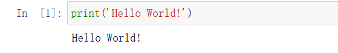
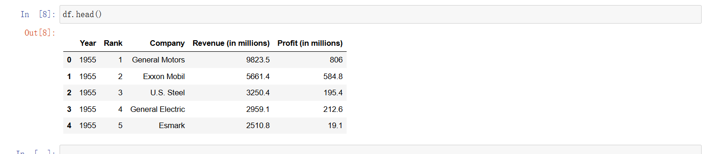
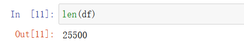
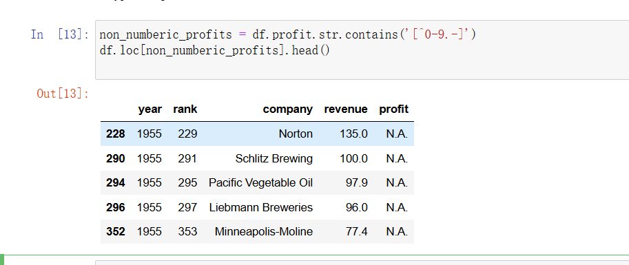
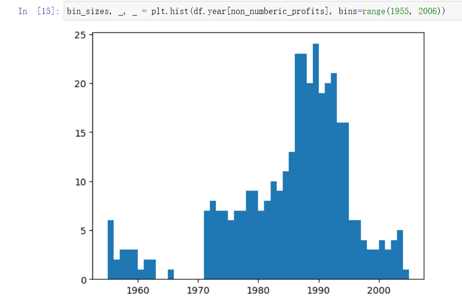
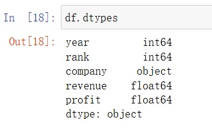
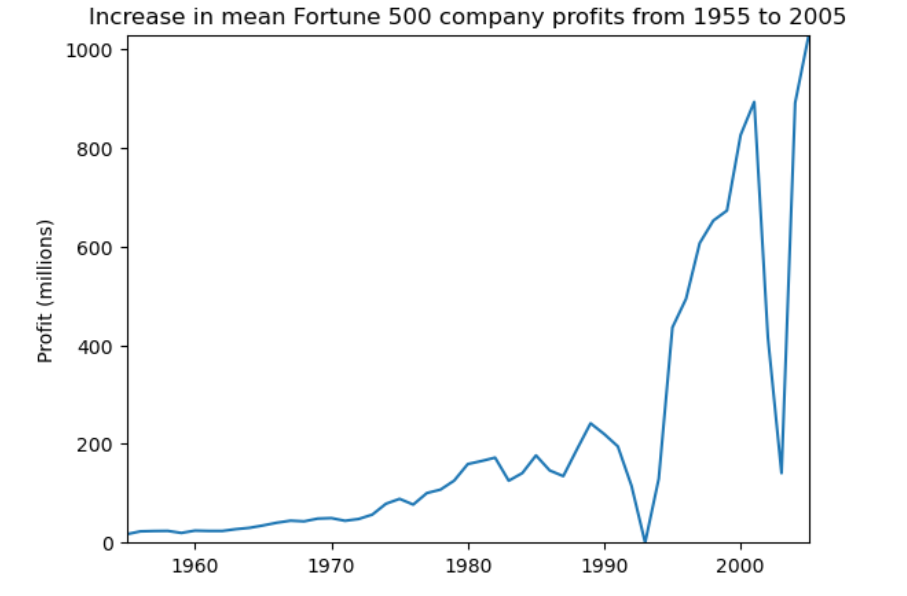
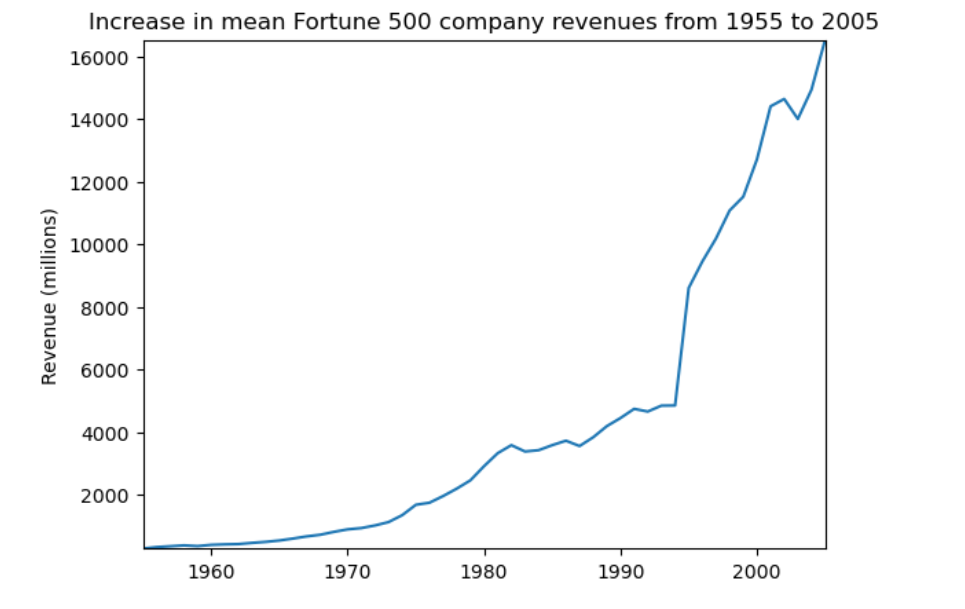
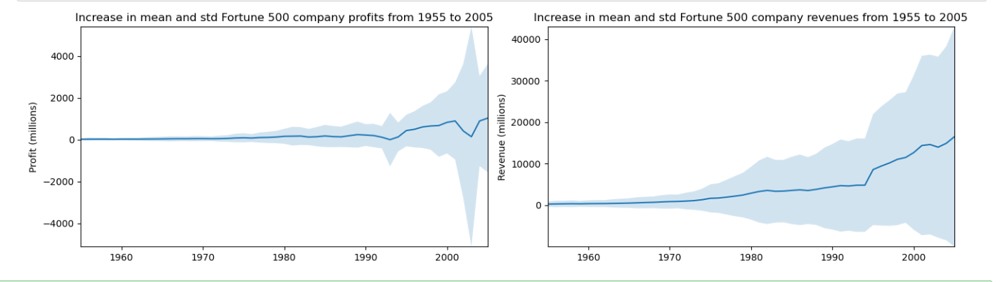
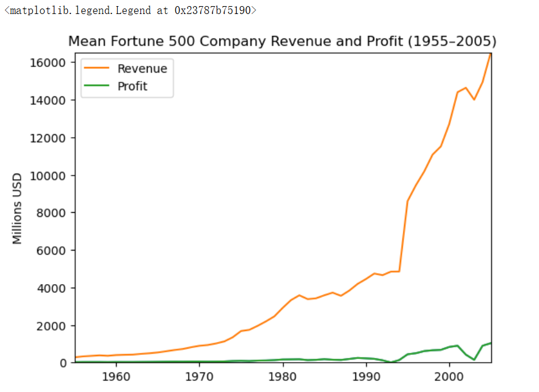

# Jupyter Notebook基础教程

## 创建一个新的Notebook

新建一个Notebook Python 3 (ipykernel)，生成了一个Untitled.ipynb文件。.ipynb文件即所谓的一个Notebook，实际是基于JSON格式的文本文件，并且包含元数据(“Edit > Edit Notebook Metadata”)。


这里有两个关键元素cell和kernal

cell: 文本或者代码执行单元，由kernel执行。
kernel: 计算引擎，执行cell的文本或者代码，本文基于Python 3 ipykernel引擎。

## cell

主要包含两种类型的cell：

代码cell：包含可被kernel执行的代码，执行之后在下方显示输出。
Markdown cell：书写Markdown标记语言的cell。
试着输入一行代码，查看执行效果：

```python
print('Hello World!')
```



代码执行之后，cell左侧的标签从In [ ] 变成了 In [1]。In代表输入，[]中的数字代表kernel执行的顺序，而In [*]则表示代码cell正在执行代码。以下例子显示了短暂的In [*]过程。


## cell模式

有两种模式，编辑模式（edit mode）和命名模式（command mode）

- 编辑模式：enter健切换，绿色轮廓
- 命令模式：esc健切换，蓝色轮廓快捷键

## 快捷键

使用Ctrl + Shift + P命令可以查看所有Notebook支持的命令。

在命名模式下，一些快捷键将十分有帮助

- 上下键头可以上下cell移动
- A 或者 B在上方或者下方插入一个cell
- M 将转换活动cell为Markdown cell
- Y 将设置活动cell为代码 cell
- D+D（两次）删除cell
- Z 撤销删除
- H 打开所有快捷键的说明

在编辑模式，Ctrl + Shift + -将以光标处作为分割点，将cell一分为二。

## Kernel

每个notebook都基于一个内核运行，当执行cell代码时，代码将在内核当中运行，运行的结果会显示在页面上。Kernel中运行的状态在整个文档中是延续的，可以跨越所有的cell。这意思着在一个Notebook某个cell定义的函数或者变量等，在其他cell也可以使用。例如：

```python
import numpy as np
def square(x):
    return x * x
```

执行上述代码cell之后，后续cell可以使用`np`和`square`

```python
x = np.random.randint(1, 10)
y = square(x)
print('%d squared is %d' % (x, y))
```


注意：Restart Kernal将清空保存在内存中的变量。同时，在浏览器中关闭一个正在运行的notebook页面，并未真正关闭终止Kernel的运行，其还是后台执行。要真正关闭，可选择File > Close and Halt，或者Kernel > Shutdown。

以下教程将分两个例子实现基本的Notebook编写，包括简单的Python程序和Python数据分析的例子。首先，重命名文档，更改Untitled并输入相关文件名。注意，在写作过程中，常用Ctrl + S保存已有的文档。

## 简单的Python程序的例子

#### 定义selection_sort函数执行选择排序功能。

```python
# 定义选择排序函数
def selection_sort(arr):
    n = len(arr)
    for i in range(n):
        # 假设当前元素是最小值
        min_index = i
        for j in range(i + 1, n):
            if arr[j] < arr[min_index]:
                min_index = j
        # 交换最小值和当前位置
        arr[i], arr[min_index] = arr[min_index], arr[i]
    return arr

```

#### 定义test函数进行测试，执行数据输入，并调用selection_sort函数进行排序，最后输出结果。

```python
# 定义测试函数
def test():
    # 输入数据
    raw_input = input("请输入一组数字，用空格分隔：")
    arr = list(map(int, raw_input.strip().split()))
    
    # 输出原始数据
    print("原始数据：", arr)
    
    # 排序
    sorted_arr = selection_sort(arr)
    
    # 输出排序结果
    print("排序后结果：", sorted_arr)

# 调用测试函数
test()

```


## 数据分析的例子

#### 设置

导入相关的工具库

```python
%matplotlib inline
import pandas as pd
import matplotlib.pyplot as plt
import seaborn as sns
```

pandas用于数据处理，matplotlib用于绘图，seaborn使绘图更美观。第一行不是python命令，而被称为line magic。%表示作用于一行，%%表示作用于全文。此处%matplotlib inline 表示使用matlib画图，并将图片输出。

随后，加载数据集。

```python
df = pd.read_csv('fortune500.csv')
```

#### 检查数据集

上述代码执行生成的df对象，是pandas常用的数据结构，称为`DataFrame`，可以理解为数据表。

```python
df.head()
```



```python
df.tail()
```


对数据属性列进行重命名，以便在后续访问

```python
df.columns = ['year', 'rank', 'company', 'revenue', 'profit']

```

接下来，检查数据条目是否加载完整。

```
len(df)
```



从1955至2055年总共有25500条目录。然后，检查属性列的类型。

```python
df.dtypes
```


其他属性列都正常，但是对于profit属性，期望的结果是float类型，因此其可能包含非数字的值，利用正则表达式进行检查。

```python
non_numberic_profits = df.profit.str.contains('[^0-9.-]')
df.loc[non_numberic_profits].head()

```



确实存在这样的记录，profit这一列为字符串，统计一下到底存在多少条这样的记录。

```
len(df.profit[non_numberic_profits])
```

```
369
```

总体来说，利润（profit）列包含非数字的记录相对来说较少。更进一步，使用直方图显示一下按照年份的分布情况。



可见，单独年份这样的记录数都少于25条，即少于4%的比例。这在可以接受的范围内，因此删除这些记录。

```python
df = df.loc[~non_numberic_profits]
df.profit = df.profit.apply(pd.to_numeric)

```

再次检查数据记录的条目数。

```
len(df)
```

```
25131
```

```
df.dtypes
```



可见，上述操作已经达到清洗无效数据记录的效果。

### 使用matplotlib进行绘图

接下来，以年分组绘制平均利润和收入。首先定义变量和方法。

```python
group_by_year = df.loc[:, ['year', 'revenue', 'profit']].groupby('year')
avgs = group_by_year.mean()
x = avgs.index
y1 = avgs.profit
def plot(x, y, ax, title, y_label):
    ax.set_title(title)
    ax.set_ylabel(y_label)
    ax.plot(x, y)
    ax.margins(x=0, y=0)

```

开始绘图

```python
fig, ax = plt.subplots()
plot(x, y1, ax, 'Increase in mean Fortune 500 company profits from 1955 to 2005', 'Profit (millions)')

```



看起来像指数增长，但是1990年代初期出现急剧的下滑，对应当时经济衰退和网络泡沫。再来看看收入曲线。

```python
y2 = avgs.revenue
fig, ax = plt.subplots()
plot(x, y2, ax, 'Increase in mean Fortune 500 company revenues from 1955 to 2005', 'Revenue (millions)')

```



公司收入曲线并没有出现急剧下降，可能是由于财务会计的处理。对数据结果进行标准差处理。

```python
def plot_with_std(x, y, stds, ax, title, y_label):
    ax.fill_between(x, y - stds, y + stds, alpha=0.2)
    plot(x, y, ax, title, y_label)
fig, (ax1, ax2) = plt.subplots(ncols=2)
title = 'Increase in mean and std Fortune 500 company %s from 1955 to 2005'
stds1 = group_by_year.std().profit.values
stds2 = group_by_year.std().revenue.values
plot_with_std(x, y1.values, stds1, ax1, title % 'profits', 'Profit (millions)')
plot_with_std(x, y2.values, stds2, ax2, title % 'revenues', 'Revenue (millions)')
fig.set_size_inches(14, 4)
fig.tight_layout()

```



可见，不同公司之间的收入和利润差距惊人，那么到底前10%和后10%的公司谁的波动更大了？此外，还有很多有价值的信息值得进一步挖掘。

#### 在同一张图上展示收入和利润

```python
import matplotlib.pyplot as plt

# 使用同一个图和坐标轴
fig, ax = plt.subplots()

# 画利润曲线
plot(x, y1, ax, 'Mean Fortune 500 Company Revenue and Profit (1955–2005)', 'Millions USD')
# 再画收入曲线
ax.plot(x, y2, label='Revenue')  # 添加label方便图例区分
ax.plot(x, y1, label='Profit')   # 再画一次Profit并加label（上面plot函数没有加label）

# 添加图例
ax.legend()

```

需要复用同一个 `ax`（坐标轴）并调用 `plot()` 两次，分别传入利润和收入数据。


